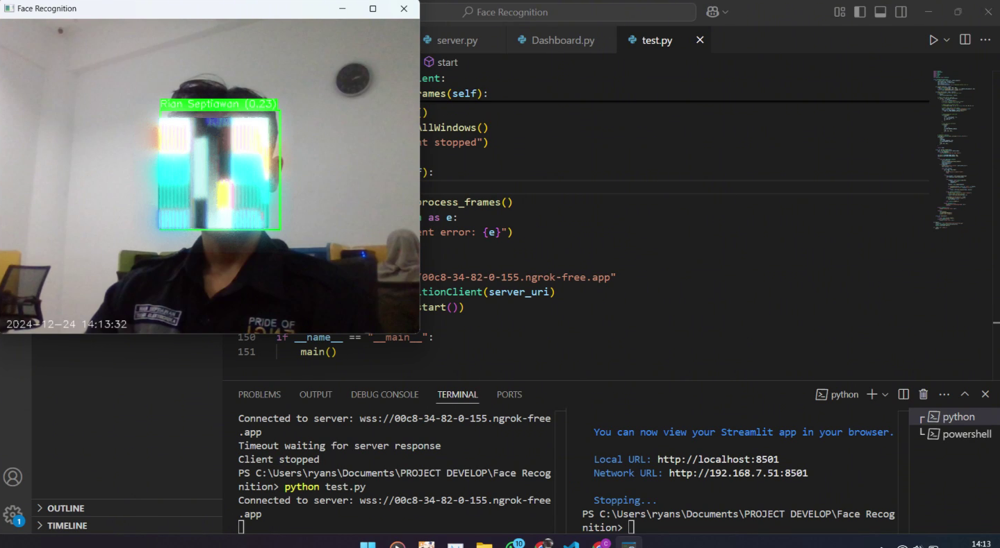
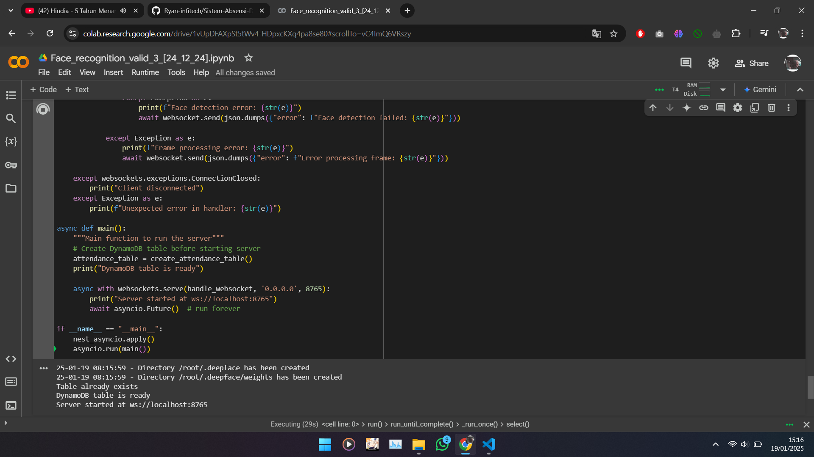
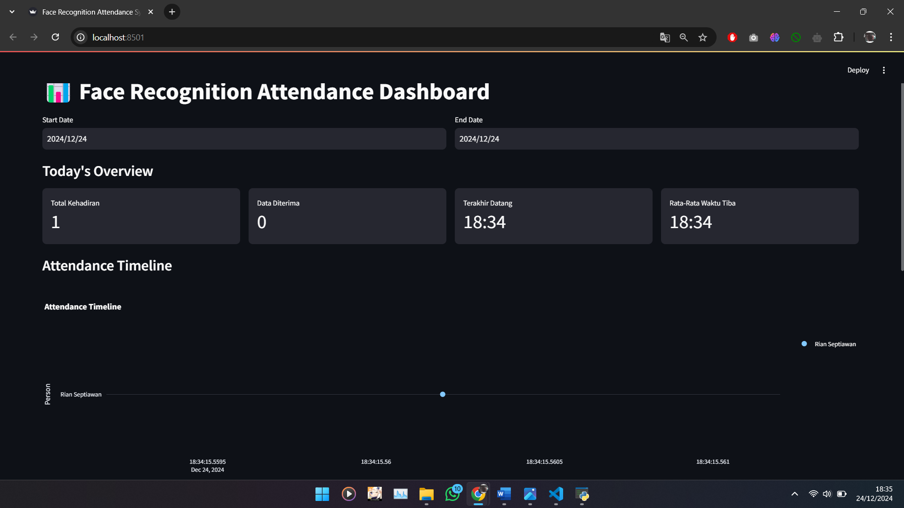

<div align="right">

<a href="README.md"></a> | <a href="README-ID.md"></a>

</div>

<br>

# Face Recognition Attendance System

A cloud-based attendance system that implements face recognition technology with cloud computing and AWS DynamoDB integration.

[](https://drive.google.com/file/d/10vniyWnw5LSTk-cXOhuWnNRsi9TZY3YB/view?usp=sharing)

## Overview

This project implements an automatic attendance system using face recognition technology, cloud computing, and AWS DynamoDB to enhance accuracy and transparency in attendance recording. The system features a lightweight client application, cloud-based processing, and real-time monitoring capabilities.

## System Architecture

The system consists of three main components:

1. **Client Application (`client.py`)**

   - Captures real-time video
   - Detects faces and sends data to cloud server
   - Provides visual feedback for face detection

   

    <br>

2. **Server Processing (`server.ipynb`)**

   - Runs on Google Colaboratory
   - Handles face recognition processing
   - Manages AWS DynamoDB interactions
   - Processes attendance data

   

    <br>

3. **Admin Dashboard (`dashboard.py`)**

   - Real-time attendance monitoring
   - Interactive reporting interface
   - Analytics visualization
   - Administrative controls

   

    <br>

## Tech Stack
<div align="center">
<br>


</div>

## Features

- Real-time face detection and recognition
- Cloud-based processing for better scalability
- Secure data storage in AWS DynamoDB
- Interactive dashboard for attendance monitoring
- Visual feedback system
- Automatic attendance recording

## Prerequisites

- Python 3.x
- AWS Account with DynamoDB access
- Google Account (for Colaboratory)
- Stable internet connection
- Required Python packages (see requirements.txt)

## Installation

1. Clone repository:

   ```bash
   git clone [repository-url]
   cd face-recognition-attendance
   ```

2. Install required packages in both side client / cloud:

   ```bash
   pip install -r requirements ...
   ```

3. Configure `Ngrok` for tunneling:

   ```bash
   !pip install pyngrok
   from pyngrok import ngrok

   # Replace with your token from ngrok dashboard
   ngrok.set_auth_token("TOKEN")

   # Start ngrok
   public_url = ngrok.connect(8765)
   print('Public URL:', public_url)
   ```

   Example: Public URL: NgrokTunnel: "https:// URL .app"

   Paste the URL into ("Client.py")
   -> server_uri = "wss:// URL .app"

4. Configure AWS credentials:

   - Set up AWS credential file
   - Configure DynamoDB access

5. Run components:

   ```bash
   # Open and run server.ipynb in Google Colaboratory
   Server.ipynb

   # Run client application
   python client.py

   # Open and run dashboard
   python dashboard.py
   ```

## Current Limitations

- Requires stable internet connection
- Face recognition accuracy depends on image quality and lighting
- Google Colaboratory session time limits
- Processing latency depends on network conditions

## Development Plans

1. Migration to more stable cloud infrastructure
2. Implementation of automatic backup mechanisms
3. Face recognition accuracy improvements
4. Offline mode capabilities
5. Advanced security features

## Contribution

Contributions to improve this system are welcome. Please follow these steps:

1. Star this repository
2. Fork the repository
3. Create a feature branch
4. Commit your changes
5. Push to the branch
6. Create Pull Request

## Contact

If you have any questions or suggestions, please open a new issue in this repository.

[](https://wa.me/6285157517798)
[](https://www.instagram.com/ryan.septiawan__/)
